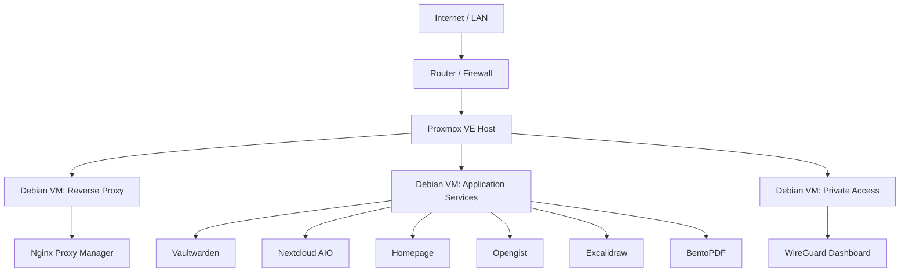

# Homelab Infrastructure

> A practical, Docker Compose based homelab starter for running personal services on Proxmox-backed Debian virtual machines.

This repository is the source of truth for my personal server environment. It documents the baseline VM setup, the service layout, and the Compose stacks used to run self-hosted applications in a small Proxmox homelab.

The goal is not to be an enterprise platform. The goal is to keep a personal homelab reproducible, understandable, and safe enough to operate with confidence.

## Contents

- [Overview](#overview)
- [Architecture](#architecture)
- [Hardware](#hardware)
- [Operating Model](#operating-model)
- [Service Catalog](#service-catalog)
- [Repository Layout](#repository-layout)
- [Getting Started](#getting-started)
- [VM Bootstrap Flow](#vm-bootstrap-flow)
- [Automation](#automation)
- [Compose Standards](#compose-standards)
- [Security Notes](#security-notes)
- [Backups and Recovery](#backups-and-recovery)
- [Roadmap](#roadmap)
- [License](#license)

## Overview

This homelab runs containerized services on Debian VMs hosted by Proxmox. Each service is represented by a dedicated Compose stack under `services/`, which makes the deployment easy to inspect, copy, and rebuild.

The current approach favors:

- Simple Docker Compose deployments over heavier orchestration.
- Clear service boundaries over one large shared host.
- Manual review of infrastructure changes before deployment.
- Documentation that explains both setup and operations.

## Architecture



The architecture is intentionally modest. Proxmox provides VM isolation, Debian provides a predictable base OS, Docker Compose provides service management, and Dockge can be used as a web UI for managing stacks.

## Hardware

| Component | Specification |
| --- | --- |
| Host | Lenovo M710q Tiny |
| CPU | Intel i7-6700, 4 cores / 8 threads |
| Memory | 32 GB DDR4 |
| Boot drive | 240 GB SSD for Proxmox |
| Data drive | 1 TB SSD/HDD for VMs and service data |
| Hypervisor | Proxmox VE |

This is a compact single-node homelab. Capacity planning is intentionally conservative: services should be easy to move, rebuild, or split into separate VMs as the environment grows.

## Operating Model

The intended runtime model is:

1. Proxmox runs directly on the physical host.
2. Debian VMs are created for isolated service groups.
3. Docker and Docker Compose are installed inside each VM.
4. Compose stacks are copied or synced from this repository.
5. Dockge can be used for web-based stack management.
6. Reverse proxy, TLS, and public exposure are handled explicitly per service.

Recommended VM baseline:

| Setting | Default |
| --- | --- |
| OS | Debian minimal |
| Boot disk | 20 GB minimum |
| RAM | 2-4 GB per lightweight service VM |
| CPU | 2 vCPU for most service VMs |
| Networking | Proxmox bridge, static LAN IP |
| Management | SSH, Docker Compose, optional Dockge |

## Service Catalog

| Service | Purpose | Default port(s) | Exposure |
| --- | --- | --- | --- |
| BentoPDF | PDF tooling | `3000` -> `8080` | Internal or reverse proxy |
| Dockge | Compose stack management UI | `5001` | LAN/admin only |
| Excalidraw | Collaborative whiteboard | `3030` -> `80` | Internal or reverse proxy |
| Homepage | Homelab dashboard | `3000` | LAN or reverse proxy |
| Nextcloud AIO | File sync and collaboration | `8090` -> `8080`, app via `11000` | Reverse proxy recommended |
| Nginx Proxy Manager | Reverse proxy and certificate management | `80`, `443`, `81` | Public web plus admin LAN-only |
| Opengist | Self-hosted Git snippets | `6157` | Internal or reverse proxy |
| PostgreSQL | Internal relational database | `5400` -> `5432` | Internal only |
| Vaultwarden | Password manager | `9445` -> `80` | Reverse proxy with strict hardening |
| WireGuard Dashboard | VPN management | `10086`, `51820/udp` | Admin/VPN only |

Before exposing any service publicly, review its authentication, TLS, backup, and update posture.

## Repository Layout

```text
homelab-infrastructure/
├── README.md
├── LICENSE
├── docs/
│   ├── README.md
│   ├── architecture.md
│   ├── bootstrap.md
│   └── operations.md
├── scripts/
│   ├── README.md
│   └── bootstrap-vm.sh
├── setup/
│   ├── 01-CREATE-VM.MD
│   ├── 02-RESIZE-BOOT-DISK.MD
│   ├── 03-SETUP-GUEST-AGENT.MD
│   ├── 04-DOCKER-SETUP.MD
│   ├── 05-DOCKGE-SETUP.MD
│   └── 06-STATIC-IP-SETUP.MD
└── services/
    ├── bento-pdf/
    ├── dockge/
    ├── excalidraw/
    ├── homepage/
    ├── nextcloud-aio/
    ├── nginx-proxy-manager/
    ├── opengist/
    ├── postgres/
    ├── vaultwarden/
    └── wireguard/
```

Each service directory now follows the same baseline structure:

```text
services/<service>/
├── docker-compose.yaml
├── .env.example
└── README.md
```

Copy `.env.example` to `.env` inside a service directory when you need to override ports, paths, domains, or service-specific settings.

Supporting documentation lives in `docs/`, while operational helper scripts live in `scripts/`.

## Getting Started

Clone the repository:

```bash
git clone https://github.com/ikranjec99/homelab-infrastructure.git
cd homelab-infrastructure
```

Review the available services:

```bash
find services -maxdepth 2 -name "docker-compose.yaml" -print
```

Deploy a service from its directory:

```bash
cd services/homepage
docker compose up -d
```

Check the resulting containers:

```bash
docker compose ps
```

This repository currently assumes you deploy stacks intentionally, one service directory at a time.

## VM Bootstrap Flow

The setup documentation is split into small steps:

1. [Create the VM](setup/01-CREATE-VM.MD)
2. [Resize the boot disk](setup/02-RESIZE-BOOT-DISK.MD)
3. [Install the Proxmox guest agent](setup/03-SETUP-GUEST-AGENT.MD)
4. [Install Docker](setup/04-DOCKER-SETUP.MD)
5. [Install Dockge](setup/05-DOCKGE-SETUP.MD)
6. [Configure a static IP](setup/06-STATIC-IP-SETUP.MD)

For a repeatable path, use the bootstrap script documented in [docs/bootstrap.md](docs/bootstrap.md).

## Automation

Fresh Debian VMs can be prepared with:

```bash
sudo ./scripts/bootstrap-vm.sh --user <user>
```

To install Dockge as part of the same run:

```bash
sudo ./scripts/bootstrap-vm.sh --user <user> --install-dockge
```

The script installs the Proxmox guest agent, Docker Engine, the Docker Compose plugin, and optional Dockge support. Manual setup notes remain under `setup/` for recovery, troubleshooting, and transparency.

## Compose Standards

Compose files in this repository should follow these conventions:

| Standard | Reason |
| --- | --- |
| One service directory per stack | Keeps deployments portable and easy to review. |
| Explicit ports | Makes network exposure visible in code review. |
| Named or documented volumes | Makes backup and restore requirements clear. |
| No committed secrets | Credentials belong in `.env` files, secret stores, or deployment-specific config. |
| `restart: unless-stopped` | Keeps services available after host reboots. |
| Service-specific documentation | Reduces guesswork during recovery or migration. |

Areas planned for improvement:

- Pin container image versions or document an update policy.
- Replace hard-coded local domains with environment variables.
- Add health checks where supported.
- Add labels for reverse proxy discovery if a single proxy model is adopted.

## Security Notes

This repository is public, so the defaults should be understandable and conservative.

Important reminders:

- Do not commit real credentials, API tokens, private keys, or production `.env` files.
- Keep admin interfaces on the LAN or behind VPN whenever possible.
- Treat access to `/var/run/docker.sock` as root-equivalent access to the host.
- Disable open registration for sensitive services unless there is a deliberate reason to allow it.
- Review firewall rules before exposing ports beyond the local network.
- Use HTTPS for any service reachable outside the LAN.
- Keep Proxmox, Debian, Docker, and container images patched.

Vaultwarden, reverse proxy administration, Dockge, and WireGuard management deserve extra care because compromise of those services can affect the rest of the environment.

## Backups and Recovery

Backups are part of the infrastructure, not an afterthought.

At minimum, document and test:

- Proxmox VM snapshots before risky changes.
- Service data volumes and bind mounts.
- Database dumps for stateful services.
- Off-host copies of important backups.
- Restore steps onto a fresh VM.

For each service, the expected future documentation should answer:

```text
What data must be backed up?
Where is it stored?
How often is it backed up?
How is it restored?
How has the restore process been tested?
```

## Roadmap

Planned improvements:

- Normalize Compose naming, ports, volumes, and time zones.
- Add linting for Markdown and YAML.
- Add CI validation for Compose files.
- Add secret scanning.
- Add backup and restore runbooks.
- Add Renovate or Dependabot for container image tracking.

## License

This project is licensed under the [MIT License](LICENSE).

You are welcome to use, fork, adapt, and improve it for your own homelab.
