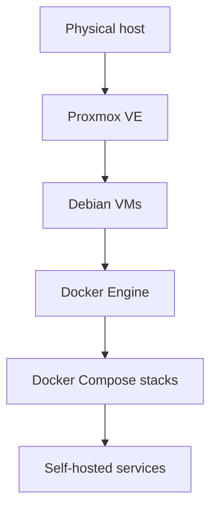

# Architecture

This homelab is built around a small set of predictable layers:

## Boundaries

| Layer | Responsibility |
| --- | --- |
| Physical host | Provides compute, storage, and network connectivity. |
| Proxmox VE | Manages virtual machines, snapshots, and host-level operations. |
| Debian VM | Provides an isolated Linux runtime for one or more service groups. |
| Docker Engine | Runs containers inside each VM. |
| Docker Compose | Defines service configuration, ports, volumes, and networks. |
| Service directories | Store per-service Compose files, examples, and notes. |

## Current Approach

The repository favors simple, inspectable building blocks:

- One directory per Compose stack.
- Explicit ports and volumes.
- `.env.example` files for local customization.
- Small setup documents for manual recovery.
- A bootstrap script for repeatable Debian VM preparation.

## Intended Direction

The structure should keep moving toward repeatability without hiding the details. Automation is useful here when it makes rebuilds easier and operations clearer.
